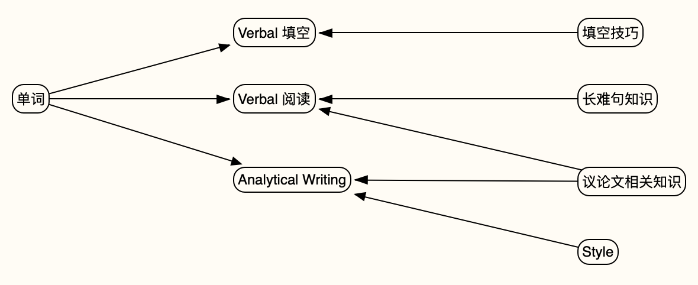

## 概述

## 单词

单词是GRE Verbal和AW的基础。

为了读懂Verbal填空和阅读题，至少背完《再要你命3000》《Magoosh Word List》 《Barron 800》。

《GRE佛脚词汇2017》可进一步减少Verbal生词。

另推荐一些GRE针对性相对没那么强，但解释详尽的单词书，有助于强化提高。

| 书名                                | 推荐理由                                                     |
| ----------------------------------- | ------------------------------------------------------------ |
| GRE核心词汇考法精析 (再要你命3000)  | 目前国内最主流的GRE单词书 ~~没有它看不懂题目~~               |
| Magoosh Word List                   | 目前国外最主流的GRE单词书=Magoosh+Barron                     |
| Barron 800 High Frequency GRE Words | 理由同上                                                     |
| Barron 1100 Words You need to know  | 解释详尽 ~~看完会觉得自己明显变强~~                          |
| GRE佛脚词汇2017                     | 本书是基于真题对《要你命3000》的增补，浏览一遍之后会觉得对真题的理解能力又一次大增 |
| Verbal Advantage                    | 解释详尽                                                     |

## Verbal 填空

填空高分=庞大的单词基础+<u>**做题技巧**</u>+人品；这里主要推荐<u>**做题技巧**</u>相关的资源。

<u>**做题技巧**</u>大概就是排除法、感情色彩判断法之类的东西。下面是学习资源推荐。

| 资源名                         | 推荐理由                 |
| ------------------------------ | ------------------------ |
| 麟渡兮填空                     | 结合OG真题的解题技巧讲解 |
| Verbal Workout for the New GRE | 另一本不错的解题技巧讲解 |
| GRE填空1100真题                | 大题库，刷题找感觉       |
| GRE佛脚备考系列填空机经        | 大题库，较上一项新       |

网上的辅导班（如Magoosh网课、新东方网课）对做题技巧似乎也有系统归纳，可自行寻找相关视频资源。

## Verbal 阅读

阅读高分=了解议论文逻辑+单词基础+读懂<u>**长难句**</u>

议论文其实我也没学透，相关资源可参考后面的AW部分；这里推荐一些<u>**长难句**</u>相关资源和题库

| 资源名                                   | 推荐理由                                             |
| ---------------------------------------- | ---------------------------------------------------- |
| 杨鹏, GRE/GMAT阅读难句教程               | 必看，“哇，原来句子还可以这么写”                     |
| 张满胜, 英语语法新思维（初级+中级+高级） | 若语法基础知识有漏洞，如不懂完成时、虚拟语气，可参考 |
| 自己找OG真题、机经真题刷                 | 刷题找感觉                                           |

## Analytical Writing 

我的成绩：GRE AW 考过**3.5分**；Scoreitnow(GRE官方机器评分服务) Issue拿过一次**4分**

总纲：对照《GRE Scoring Guide: Analyze an Issue》(Page 50, GRE OG 2ed.) 提高水平；拒绝无脑背模板。

### Analysis

| 资源名               | 推荐理由                                                     |
| -------------------- | ------------------------------------------------------------ |
| Writing Analytically | 什么是论点、论证、论据？如何建立有说服力的论证？如何合理地组织小论点以支持总论点？这本书会给你答案。 |

### Style

同一个意思可以用不同的句子表达，不同的表达形式构成了不同的style。下面的书能让你以更清晰（or 易于理解）的方式表达想法。

| 资源名                                                  | 推荐理由                 |
| ------------------------------------------------------- | ------------------------ |
| Joseph M. Williams, Style: Lessons in Clarity and Grace | 详细阐述了何谓Clarity    |
| Helen Sword, The Writer's Diet                          | 同上                     |
| Michael Harvey, The Nuts and Bolts of College Writing   | 同上                     |
| Brooks Landon, Building Great Sentences                 | 教你如何写出易读的复杂句 |

###### PS：以上所推荐资源基于[知乎-如何进一步提高英文文笔？NONOLAN的回答](https://www.zhihu.com/question/30647007/answer/51992643)和我个人的学习体验。感谢NONOLAN。

## Quantative

这个对中国学生应该不构成障碍吧。裸考就好。